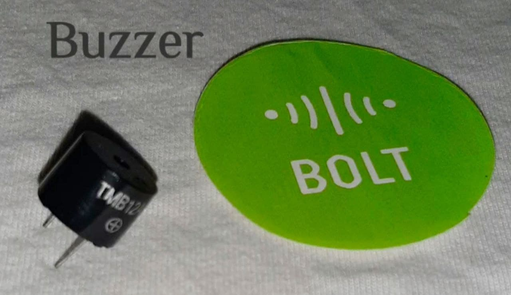
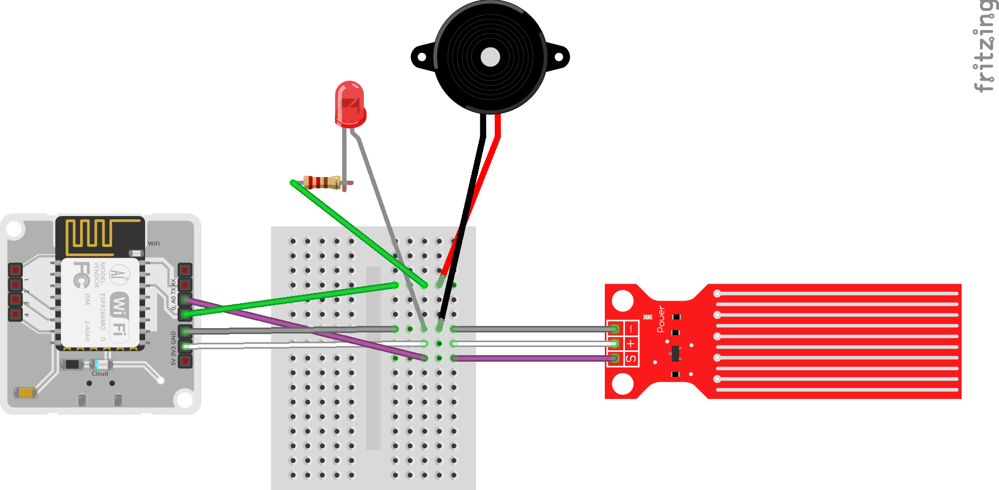

# WATERLEVEL-ALERT-DETECTION-USING-BOLT-IOT
A water level sensor project that sends alert through buzzer and sms when water level exceeds threshold values. It is made using bolt IOT.

<h1>Things used in this project</h1>

1. Breadboard (generic)
2. water sensor [REES52]
3. 5 mm LED: Yellow
4. Buzzer
5. Jumper wires (generic)
6. Resistor 330 ohm
7. USB-A to Micro-USB Cable

<h1>Software apps and online services</h1>
1. Bolt IoT Bolt Cloud
2. Bolt IoT Android App
3. Notification Reader - Shouter

<h1>Thanks to BOLT !</h1>

	I thank Bolt platform which made my work easier to complete my project. it is a very user friendly and convenient platform. it made me clarify my doubts and issues by posting them in the bolt forum.

<h1>Project:</h1>

I used a REES52 Water Sensor in this project which is an easy-to-use, cost-effective high level/drop recognition sensor which is obtained by having a series of parallel wires exposed traces measured droplets/water volume in order to determine the water level.

The Python Script checks the REES52 Water Sensor value sent from bolt device to the Bolt Cloud for every 10 sec and the sensor value doesn't exceed 10 until the water comes in contact with the sensor and as soon as the water falls on the sensor it crosses threshold value then it switches on the BUZZER and LED which goes off in 1 min during that time it requests the Twillio API to send SMS to your phone number. The telegram bot you created sends a message to channel that has your employees and we even get a VOICE notification, and we will even get a MAIL from the python program through Mailgun.

<h2>
1.Creating an account on the IOT cloud service(if you already have an account you can just skip to the next step)</h2>
Open www.cloud.boltiot.com on your web browser.

you can sign up by filling your details. Then you will be getting the following page.

<h2>2.Linking the Bolt module to the cloud</h2>
Step 1: Open the playstore app on your mobile and search for Bolt Iot app and install it.
Step 2: Login using the bolt cloud credentials and Follow the instructions specified by the app, using those instructions Link your Bolt Module to the cloud.

After linking your bolt cloud page would be looking like...

<h2>3. Hardware Setup</h2>

<h2>
	4. Creating an account on Twillio
</h2>
Twilio is a third-party SMS functionality provider. It is a cloud communications platform as a service (PaaS) company. Twilio allows software developers to programmatically make and receive phone calls and also send and receive text messages using its web service APIs. 

Step 1: Open https://www.twilio.com/ In browser. 

Step 2: Sign up, choose language as Python and we are building account notification. After filling the details press next and verify your number.
 
Step 3: After verifying the number you will be redirected to Twillio home page, then click on products choose programmable sms, click continue give appropriate name for your project. by giving appropriate name.
 
Step 4: Then you can go to dash board. Create a new number. click on choose this number. Copy the ACCOUNT SID and AUTH TOKEN, FROM_NUMBER to your python conf file.
 

<h2>5. Creating an account on Mailgun</h2>
Mailgun is an Email automation service. It has a very powerful set of inbuilt functions for sending emails. Developers can process their email with the help of Mailgun API. We require Mailgun in order to send emails from a python program.
<h3>Step 1 - Go to Mailgun</h3>
Open www.mailgun.com on your browser. Click on the "Start Sending" button to register for an account.
<h3>Step 2 - Sign up for an account</h3>
Fill in the signup form with your details. For the "Company" field, you can put "Student" if you are a student. You can enter your personal email ID for the "Work email" field.
 
Click on "Create Account" once you have entered all your details.
<h3>Step 3 - Verify your account</h3>
Once you have clicked on "Create Account" button on the sign up page, you will be redirected to your dashboard where you will be asked to verify your email ID. Check your email inbox for an email from them asking to verify your Mailgun account. Follow the instructions in the email and verify your account.
 
Once you have verified your email ID, you will be asked to verify your mobile number also. This verification is required in order to stop spam emails being sent out by robots or other people with malicious intent.
 
Select your country and enter your 10 digit mobile number. Click on "Send verification code" to start the verification process. You will receive an OTP from Mailgun and will need to enter it in the next screen in order to verify your mobile number.
 
<h3>Step 4 - Get API credentials</h3>
Once you have verified your mobile number, you will now be redirected to the Mailgun dashboard.
 
Now, since we will be sending an email using python code, we will need API credentials for it. To get your credentials, on the sidebar, click on "Sending" and then click on "Overview".
 
On the Overview page, you will be asked which method we would be using to send emails. Since we are programmatically sending emails using Python code, we will choose the options accordingly.
 
Select "API" option and then choose "Python" in the next step.
 
Once you have done the above steps, you will now be presented with your API credentials. From this, we will need two credentials i.e. the Sandbox URL and the API key.
 
In the picture below, the credentials are highlighted. Save both of them as it will be required in the next lecture to send the emails.

<h4>NOTE -</h4>
<b>Since this is trial account, you cannot send emails to everyone. You can only send emails to yourself, i.e. the same email ID you have registered on Mailgun.</b> 
To send emails to any other email ID, you will need to add them to the Authorized recipients list. They will be sent an email confirming the same and if they accept, you will then be able to send emails to them.

<h2>Schematics
	</h2>

